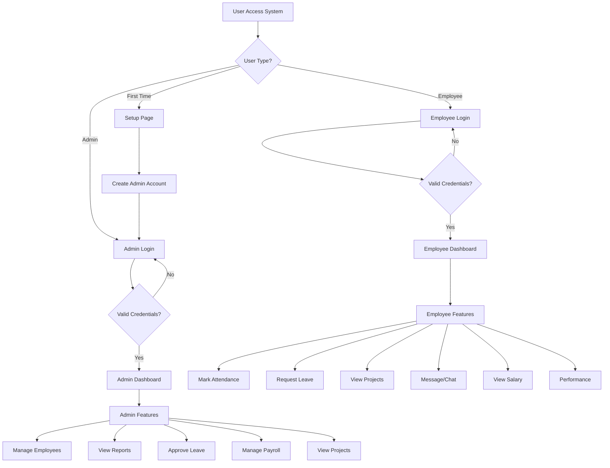
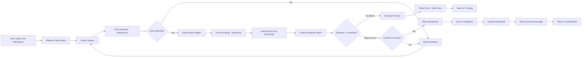
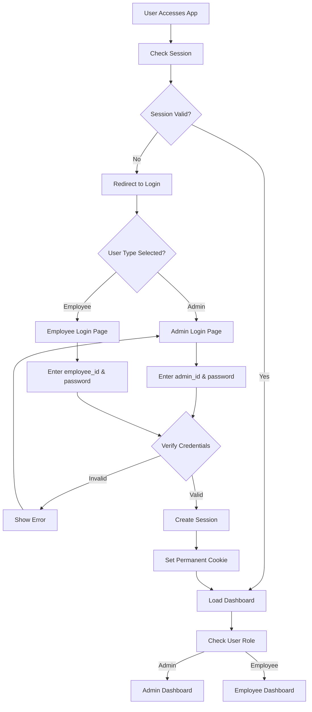
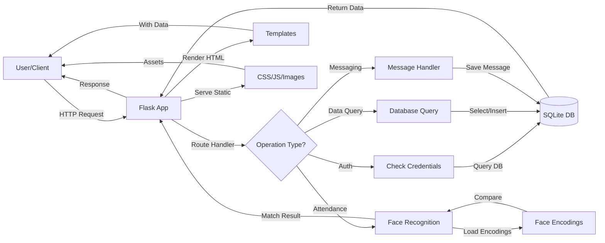

# WorkHub AI - Attendance System - Complete Flowchart & Architecture

## 📊 System Architecture Overview

```
┌─────────────────────────────────────────────────────────────────────────┐
│                         WORKHUB AI SYSTEM ARCHITECTURE                   │
├─────────────────────────────────────────────────────────────────────────┤
│                                                                           │
│  ┌──────────────────────────────────────────────────────────────┐      │
│  │                     PRESENTATION LAYER (Frontend)            │      │
  │  ┌──────────────┐  ┌──────────────┐                          │      │
  │  │ Admin Panel  │  │ Employee App │                          │      │
  │  │ Dashboard    │  │ Dashboard    │                          │      │
│  │  └──────────────┘  └──────────────┘  └──────────────┘        │      │
│  │         ↓                   ↓                   ↓               │      │
│  │  [HTML5/CSS/JS] - Bootstrap Responsive UI                    │      │
│  └──────────────────────────────────────────────────────────────┘      │
│                                  ↓                                       │
│  ┌──────────────────────────────────────────────────────────────┐      │
│  │              APPLICATION LAYER (Flask Backend)               │      │
│  │                                                               │      │
│  │  ┌─────────────────────────────────────────────────────┐     │      │
│  │  │ Authentication & Session Management                 │     │      │
│  │  │  - Admin Login/Setup                                │     │      │
│  │  │  - Employee Login                                   │     │      │
│  │  └─────────────────────────────────────────────────────┘     │      │
│  │                                                               │      │
│  │  ┌─────────────────────────────────────────────────────┐     │      │
│  │  │ Face Recognition Module (camera_api.py)             │     │      │
│  │  │  - Face Detection (RetinaFace)                       │     │      │
│  │  │  - Face Encoding (DeepFace)                          │     │      │
│  │  │  - Similarity Matching                               │     │      │
│  │  │  - Attendance Marking                                │     │      │
│  │  └─────────────────────────────────────────────────────┘     │      │
│  │                                                               │      │
│  │  ┌─────────────────────────────────────────────────────┐     │      │
│  │  │ Business Logic Routes                                │     │      │
│  │  │  - Admin Routes (employee management, reports)       │     │      │
│  │  │  - Employee Routes (dashboard, leave, projects)      │     │      │
│  │  │  - Attendance Routes (mark, history)                 │     │      │
│  │  │  - Messaging Routes (group chat, notifications)      │     │      │
│  │  │  - Payroll Routes (salary management)                │     │      │
│  │  │  - Performance Routes (reviews, feedback)            │     │      │
│  │  └─────────────────────────────────────────────────────┘     │      │
│  └──────────────────────────────────────────────────────────────┘      │
│                                  ↓                                       │
│  ┌──────────────────────────────────────────────────────────────┐      │
│  │                    DATA LAYER (SQLite)                        │      │
│  │                                                               │      │
│  │  ┌──────────┐ ┌──────────┐ ┌──────────┐ ┌──────────┐        │      │
│  │  │  Admin   │ │Employees │ │Attendance│ │ Messages │        │      │
│  │  │  Table   │ │  Table   │ │  Table   │ │  Table   │        │      │
│  │  └──────────┘ └──────────┘ └──────────┘ └──────────┘        │      │
│  │                                                               │      │
│  │  ┌──────────┐ ┌──────────┐ ┌──────────┐ ┌──────────┐        │      │
│  │  │  Leave   │ │ Projects │ │ Payroll  │ │  Reviews │        │      │
│  │  │  Table   │ │  Table   │ │  Table   │ │  Table   │        │      │
│  │  └──────────┘ └──────────┘ └──────────┘ └──────────┘        │      │
│  │                                                               │      │
│  │  ┌──────────┐ ┌──────────┐ ┌──────────┐                      │      │
│  │  │  Groups  │ │ Leave    │ │Notifications                     │      │
│  │  │  Table   │ │  Types   │ │  Table   │                      │      │
│  │  └──────────┘ └──────────┘ └──────────┘                      │      │
│  └──────────────────────────────────────────────────────────────┘      │
│                                  ↓                                       │
│  ┌──────────────────────────────────────────────────────────────┐      │
│  │              UTILITY LAYERS                                   │      │
│  │  ┌─────────────┐  ┌─────────────┐  ┌─────────────┐           │      │
│  │  │ Face Utils  │  │ Camera API  │  │Config/Paths │           │      │
│  │  │(Encoding)   │  │(Video Feed) │  │(PyInstaller)│           │      │
│  │  └─────────────┘  └─────────────┘  └─────────────┘           │      │
│  └──────────────────────────────────────────────────────────────┘      │
│                                  ↓                                       │
│  ┌──────────────────────────────────────────────────────────────┐      │
│  │         EXTERNAL LIBRARIES & DEPENDENCIES                     │      │
│  │  Flask │ OpenCV │ DeepFace │ TensorFlow │ NumPy │ Pillow │  │      │
│  └──────────────────────────────────────────────────────────────┘      │
│                                                                           │
└─────────────────────────────────────────────────────────────────────────┘
```

---

## 🔄 Main Application Flow



---

## 📹 Face Recognition & Attendance Flow



---

## 💾 Database Schema Overview

```
┌─────────────────────────────────────────┐
│              DATABASE TABLES             │
├─────────────────────────────────────────┤
│                                          │
│ ADMIN                                    │
│ ├─ admin_id (PK)                         │
│ ├─ password_hash                         │
│ └─ name                                  │
│                                          │
│ EMPLOYEES                                │
│ ├─ employee_id (PK)                      │
│ ├─ name                                  │
│ ├─ email                                 │
│ ├─ password_hash                         │
│ ├─ department                            │
│ ├─ position                              │
│ ├─ phone                                 │
│ ├─ salary                                │
│ ├─ hire_date                             │
│ └─ face_encoding (BLOB)                  │
│                                          │
│ ATTENDANCE                               │
│ ├─ id (PK)                               │
│ ├─ employee_id (FK)                      │
│ ├─ date                                  │
│ ├─ time_in                               │
│ ├─ time_out                              │
│ ├─ status (Present/Absent/Late)          │
│ ├─ latitude                              │
│ ├─ longitude                             │
│ ├─ is_manual                             │
│ └─ marked_by_admin                       │
│                                          │
│ LEAVE_REQUESTS                           │
│ ├─ id (PK)                               │
│ ├─ employee_id (FK)                      │
│ ├─ leave_type (FK)                       │
│ ├─ start_date                            │
│ ├─ end_date                              │
│ ├─ reason                                │
│ ├─ status (Pending/Approved/Rejected)    │
│ └─ approved_by                           │
│                                          │
│ LEAVE_TYPES                              │
│ ├─ id (PK)                               │
│ ├─ type_name                             │
│ └─ days_per_year                         │
│                                          │
│ PROJECTS                                 │
│ ├─ id (PK)                               │
│ ├─ project_name                          │
│ ├─ description                           │
│ ├─ start_date                            │
│ ├─ end_date                              │
│ ├─ status                                │
│ └─ assigned_to (FK - Employee)           │
│                                          │
│ MESSAGES                                 │
│ ├─ id (PK)                               │
│ ├─ sender_id                             │
│ ├─ group_id (FK)                         │
│ ├─ message_text                          │
│ ├─ timestamp                             │
│ └─ is_read                               │
│                                          │
│ GROUPS                                   │
│ ├─ group_id (PK)                         │
│ ├─ group_name                            │
│ ├─ description                           │
│ └─ created_by                            │
│                                          │
│ GROUP_MEMBERS                            │
│ ├─ group_id (FK)                         │
│ ├─ user_id                               │
│ └─ user_type (admin/employee)            │
│                                          │
│ PAYROLL                                  │
│ ├─ id (PK)                               │
│ ├─ employee_id (FK)                      │
│ ├─ month                                 │
│ ├─ base_salary                           │
│ ├─ deductions                            │
│ ├─ bonus                                 │
│ └─ net_salary                            │
│                                          │
│ PERFORMANCE_REVIEWS                      │
│ ├─ id (PK)                               │
│ ├─ employee_id (FK)                      │
│ ├─ reviewer_id (FK - Admin)               │
│ ├─ rating                                │
│ ├─ comments                              │
│ └─ review_date                           │
│                                          │
│ NOTIFICATIONS                            │
│ ├─ id (PK)                               │
│ ├─ user_id                               │
│ ├─ message                               │
│ ├─ is_read                               │
│ └─ timestamp                             │
│                                          │
└─────────────────────────────────────────┘
```

---

## 🗂️ Project Directory Structure

```
attendance/
│
├── 📄 app.py                           # Main Flask application
├── 📄 config.py                        # Configuration & constants
├── 📄 database.py                      # Database connection
├── 📄 init_db.py                       # Database initialization
├── 📄 models.py                        # Data models (placeholder)
├── 📄 face_utils.py                    # Face encoding utilities
├── 📄 camera_api.py                    # Face recognition API
├── 📄 requirements.txt                 # Python dependencies
│
├── 📁 templates/                       # HTML Templates
│   ├── home.html                       # Home page
│   ├── setup.html                      # Initial admin setup
│   ├── admin_login.html                # Admin login
│   ├── admin_dashboard.html            # Admin main dashboard
│   ├── admin_messages.html             # Admin messages
│   ├── admin_projects.html             # Admin project management
│   ├── employee_login.html             # Employee login
│   ├── employee_dashboard.html         # Employee dashboard
│   ├── employee_messages.html          # Employee messages
│   ├── employee_projects.html          # Employee projects
│   ├── employee_request_leave.html     # Leave request form
│   ├── employee_leave_history.html     # Leave history
│   ├── employee_performance.html       # Performance reviews
│   ├── employee_reviews.html           # Review details
│   ├── live_attendance.html            # Live face recognition
│   ├── leave_management.html           # Leave management
│   ├── payroll.html                    # Payroll management
│   ├── performance_reviews.html        # Performance review page
│   ├── project_details.html            # Project details
│   ├── project_reports.html            # Project reports
│   ├── email_settings.html             # Email configuration
│   ├── user_preferences.html           # User preferences
│   ├── notifications.html              # Notifications page
│   └── ...
│
├── 📁 static/                          # Static assets
│   ├── 📁 css/
│   │   └── style.css                   # Main stylesheet
│   │
│   ├── 📁 js/
│   │   ├── main.js                     # Main JavaScript
│   │   ├── camera.js                   # Webcam/camera handling
│   │   └── dashboard.js                # Dashboard functionality
│   │
│   ├── 📁 uploads/                     # Uploaded files
│   │
│   └── 📁 images/                      # Static images
│
├── 📁 captured_faces/                  # Face encodings storage
│
├── 📁 build/                           # PyInstaller build files
│   └── 📁 build_workhubai/
│
├── 📄 build_executable.py              # Executable builder
├── 📄 build_workhubai.spec             # PyInstaller spec file
│
└── 📄 database.db                      # SQLite database

```

---

## 🔐 Authentication & Authorization Flow



---

## 📱 Key Features & Modules

### 1. **Face Recognition System**
   - **Library**: DeepFace + RetinaFace
   - **Process**: 
     - Real-time face detection from webcam
     - Generate face embeddings (128D vector)
     - Compare with stored encodings
     - Adaptive threshold matching
   - **File**: `camera_api.py`, `face_utils.py`

### 2. **Attendance Management**
   - Mark attendance via face recognition
   - Manual attendance entry by admin
   - Location-based tracking (lat/long)
   - Attendance history & reports
   - Late/Absent tracking

### 3. **Leave Management**
   - Multiple leave types
   - Leave request workflow
   - Admin approval system
   - Leave balance tracking
   - Leave history

### 4. **Messaging System**
   - Group-based chat
   - Real-time notifications
   - Message history
   - Read/unread status

### 5. **Payroll System**
   - Salary calculations
   - Deductions management
   - Bonus handling
   - Monthly payroll reports

### 6. **Performance Management**
   - Employee reviews
   - Rating system
   - Feedback comments
   - Performance history

### 7. **Project Management**
   - Project assignment
   - Project tracking
   - Project reports
   - Status updates

---

## 🔌 API Endpoints Overview

### Admin Routes
```
GET/POST  /setup                          → Initial admin setup
GET/POST  /admin_login                    → Admin authentication
GET       /admin_dashboard                → Main admin dashboard
GET/POST  /admin/employees                → Employee management
GET/POST  /admin/reports                  → Generate reports
GET/POST  /admin/payroll                  → Payroll management
GET/POST  /admin/leave/approve            → Approve/reject leave
```

### Employee Routes
```
GET/POST  /employee_login                 → Employee authentication
GET       /employee_dashboard             → Main employee dashboard
GET/POST  /attendance/mark                → Mark attendance (face)
GET       /attendance/history             → Attendance records
GET/POST  /leave/request                  → Request leave
GET       /leave/history                  → Leave history
GET/POST  /projects                       → View/manage projects
GET/POST  /messages                       → Messaging
GET       /payroll                        → View salary
GET       /performance                    → View reviews
```

### Face Recognition Routes
```
GET       /camera/stream                  → Video stream endpoint
POST      /camera/mark_attendance         → Mark attendance via face
POST      /camera/encode_face             → Encode employee face
GET       /captured_faces/<employee_id>   → Get stored face
```

---

## 🛠️ Technology Stack

| Layer | Technology | Purpose |
|-------|-----------|---------|
| **Frontend** | HTML5, CSS3, JavaScript | User interface |
| **Backend** | Flask (Python) | Web framework |
| **Database** | SQLite | Data persistence |
| **Face Recognition** | DeepFace, RetinaFace | Face detection & encoding |
| **ML Framework** | TensorFlow 2.10 | Deep learning backend |
| **Image Processing** | OpenCV, Pillow | Image handling |
| **Data Processing** | NumPy, Pandas, SciPy | Numerical operations |
| **Security** | Werkzeug | Password hashing |
| **Deployment** | PyInstaller | Windows executable |

---

## 📊 Data Flow Diagram



---

## 🔑 Key Python Files Breakdown

### `app.py` (Main Application)
- Flask app initialization
- Route handlers for all pages
- Session management
- Admin/Employee authentication
- Business logic routing

### `camera_api.py` (Face Recognition)
- Video stream endpoint
- Face detection & encoding
- Attendance marking via face
- Real-time face processing

### `face_utils.py` (Face Operations)
- Face encoding generation
- Face comparison logic
- Quality assessment
- Database encoding storage

### `database.py` (DB Connection)
- SQLite connection management
- Connection pooling
- Safe connection closure

### `init_db.py` (Database Setup)
- Table creation
- Schema definition
- Default data seeding
- Database migrations

### `config.py` (Configuration)
- PyInstaller path handling
- Face recognition thresholds
- Session configuration
- Upload folder paths

---

## 🚀 Deployment

### Windows Executable
- Uses **PyInstaller** for packaging
- File: `build_executable.py`
- Creates single `.exe` file
- Bundles all dependencies & assets

### Running as Executable
```
build_workhubai.exe
```

### Running as Python
```
python app.py
```

---

## 🎯 System Features Summary

✅ Multi-user authentication (Admin/Employee)
✅ Face recognition-based attendance
✅ Real-time video streaming
✅ Leave management & approval workflow
✅ Payroll system
✅ Performance reviews
✅ Project management
✅ Group messaging
✅ Attendance reports
✅ Responsive web interface
✅ Location tracking
✅ Manual attendance entry
✅ Notification system
✅ Database persistence
✅ PyInstaller packaging

---

## 📈 User Journey Maps

### Admin User Journey
```
Login → Dashboard → Manage Employees → View Reports → Approve Leave 
   → Manage Payroll → Review Performance → Send Messages → Logout
```

### Employee User Journey
```
Login → Dashboard → Mark Attendance (Face) → View History → Request Leave 
   → View Projects → Check Salary → Read Reviews → Messages → Logout
```

---

**Generated**: 2026-05-29
**System**: WorkHub AI - Comprehensive Attendance & Management System
